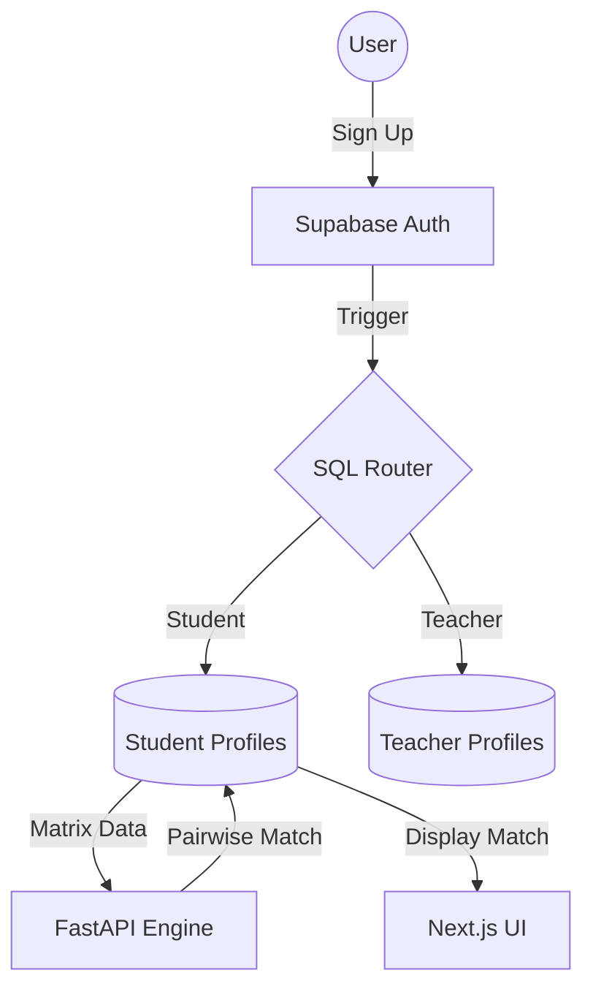

# Cohort Connect

An intelligent peer-matching and collaboration platform for Imperial STEM. Features: AI matching (scikit-learn), real-time team coaching (Gemini 1.5 Pro), and accountability tracking. Built with Next.js, FastAPI, and Supabase for the Grand Challenge 2 2026.

Language Python, API framework FastAPI, Database SQLite, AI matching Claude API, Hosting next.js, Version control GitHub Required by brief

This is a [Next.js](https://nextjs.org) project bootstrapped with [`create-next-app`](https://nextjs.org/docs/app/api-reference/cli/create-next-app).

markdown_content = """# Cohort Connect
### Team: Cohort Connect
**Grand Challenge:** AI Agents for Matching Learners with Learners

## 🌍 Grand Challenge Addressed
In university settings—ranging from high-stakes labs to complex mathematics coursework—group formation is often the weakest link. **Random Allocation** leads to "Communication Friction" (clashing work styles), while **Self-Selection** leads to "Skill Silos" (friends with identical strengths pairing up). 

**Cohort Connect** solves this by using an algorithmic approach to group formation that ensures students share a common "work vibe" while possessing the diverse skills necessary to complete multifaceted projects.

## 💡 Problem Statement & Solution Overview
**The Problem:** Inefficient group work stems from two main issues:
1. **Approach Incompatibility:** Teammates who communicate or handle deadlines in fundamentally different ways.
2. **Skill Homogeneity:** Groups that lack specific technical or soft skills (e.g., a team of great coders who cannot write reports).

**The Solution:** An intelligent matchmaking agent that processes student profiles into a multidimensional matrix. It applies **Alignment Logic** (seeking small differences) for work approaches and **Complementary Logic** (seeking large differences) for technical skills.

## 🛠 Technology Stack & Architecture
### Backend & Data
* **Supabase (PostgreSQL):** A relational database utilizing a dual-table structure (`student_profiles` and `teacher_profiles`) with automated routing via SQL Triggers.
* **FastAPI (Python):** The engine that processes the pairwise matrix and calculates match scores.
* **Row Level Security (RLS):** Industry-standard security ensuring students only access their own data and their assigned match.

### Frontend
* **Next.js:** A responsive React framework for the onboarding survey and student dashboard.
* **Tailwind CSS:** For modern, accessible UI design.

### 🏗 Architecture Diagram

## 📊 The Matching Matrix
Our algorithm evaluates students based on three distinct categories:

### 1. Previous Subject Experience
* **A-Level (or equivalent) Background:** List of subject choices to identify baseline knowledge.
* **Ancillary Modules:** Ancillary module choices to ensure academic diversity within groups.

### 2. Relevant Skills (Complementary Matching)
Students are paired to ensure the group has high confidence (**4-5**) across all domains:
* **Coding** (1-5 confidence)
* **Written Reports** (1-5 confidence)
* **Presentation/Public Speaking** (1-5 confidence)
* **Mathematical Literacy** (1-5 confidence)
* **Understanding Abstract/Complex Content** (1-5 confidence)
* **Conflict Resolution** (1-5 confidence)

### 3. Approach to Work (Alignment Matching)
Students are paired based on similar scores to reduce friction:
* **Deadline Style:** Steady workers (**1**) vs. Under-pressure performers (**5**).
* **Discussion Style:** Listeners (**1**) vs. Leaders (**5**). *Note: This should be matched for alignment, not extreme bias.*
* **Disagreement Resolution:** Address issues directly (**1**) vs. Avoidance to prevent confrontation (**5**).
* **Concept Processing:** Independent work (**1**) vs. Collaborative work (**5**).
* **Communication Preference:** Frequent/Informal (**1**) vs. Structured/Formal (**5**).
* **Expectation Management:** Do it myself (**1**) vs. Discuss with teammate (**5**).
* **Workload Management:** Independent management (**1**) vs. Team redistribution (**5**).
* **Project Role:** Focused individual tasks (**1**) vs. Group coordination (**5**).
* **Critical Feedback Instinct:** Defensive/Explaining (**1**) vs. Listening/Revising (**5**).

---

## 🚀 Installation and Setup
### Prerequisites
* **Node.js:** [Insert Version]
* **Python:** [Insert Version]
* **Supabase Account**

### 1. Database Setup
1. Create a new Supabase project.
2. Run the `schema.sql` script located in the `/database` folder.
3. This will initialize the tables, the `user_role` types, and the `handle_new_auth_user_routing` trigger.

### 2. Backend Setup
```bash
cd backend
pip install -r requirements.txt
# Add SUPABASE_URL and SERVICE_ROLE_KEY to .env
uvicorn main:app --reload
```
### 3. Frontend Setup
```bash
cd frontend
npm install
# Add NEXT_PUBLIC_SUPABASE_URL and ANON_KEY to .env.local
npm run dev
```
## 📖 Usage Guide
1. **Onboarding:** Students sign up and are automatically routed to the student database.

2. **The Survey:** Students complete a three-part survey to build their matrix profile.

3. **Submission:** Upon completion, the profile is "Locked" to ensure data integrity for the matching algorithm.

4. **Match Discovery:** Once the teacher initiates a match, students can view their partner, their partner's skills, and a "Match Reason" generated by the agent.

🤖 Future Feature: Collaboration Coach
[Space reserved for the Collaboration Coach agent: A tool to identify group friction via periodic reflection check-ins.]
**🎥 Demo Video**
[Link to Demo Video Here]

## 👥 Team Member Details and Contributions
* **[Insert Name] (Data Lead):** Designed the relational schema, SQL triggers for automated student/teacher routing, RLS security policies, and the data-locking mechanism.

* **[Insert Name] (Frontend Lead):** Developed the Next.js UI, multi-page survey logic, and Supabase Auth integration.

* **[Insert Name] (Backend/Algorithm Lead):** Developed the FastAPI engine and the pairwise matrix comparison algorithm.

* **[Insert Name] (Creative Lead):** Generated ideas for survey, presentation slides, monitoring the integration of frontend, backend and data.

## 📜 License Information
This project is licensed under the MIT License.

## Getting Started

First, run the development server:

```bash
npm run dev
# or
yarn dev
# or
pnpm dev
# or
bun dev
```

Open [http://localhost:3000](http://localhost:3000) with your browser to see the result.

You can start editing the page by modifying `app/page.tsx`. The page auto-updates as you edit the file.

This project uses [`next/font`](https://nextjs.org/docs/app/building-your-application/optimizing/fonts) to automatically optimize and load [Geist](https://vercel.com/font), a new font family for Vercel.

## Learn More

To learn more about Next.js, take a look at the following resources:

- [Next.js Documentation](https://nextjs.org/docs) - learn about Next.js features and API.
- [Learn Next.js](https://nextjs.org/learn) - an interactive Next.js tutorial.

You can check out [the Next.js GitHub repository](https://github.com/vercel/next.js) - your feedback and contributions are welcome!

## Deploy on Vercel

The easiest way to deploy your Next.js app is to use the [Vercel Platform](https://vercel.com/new?utm_medium=default-template&filter=next.js&utm_source=create-next-app&utm_campaign=create-next-app-readme) from the creators of Next.js.

Check out our [Next.js deployment documentation](https://nextjs.org/docs/app/building-your-application/deploying) for more details.
