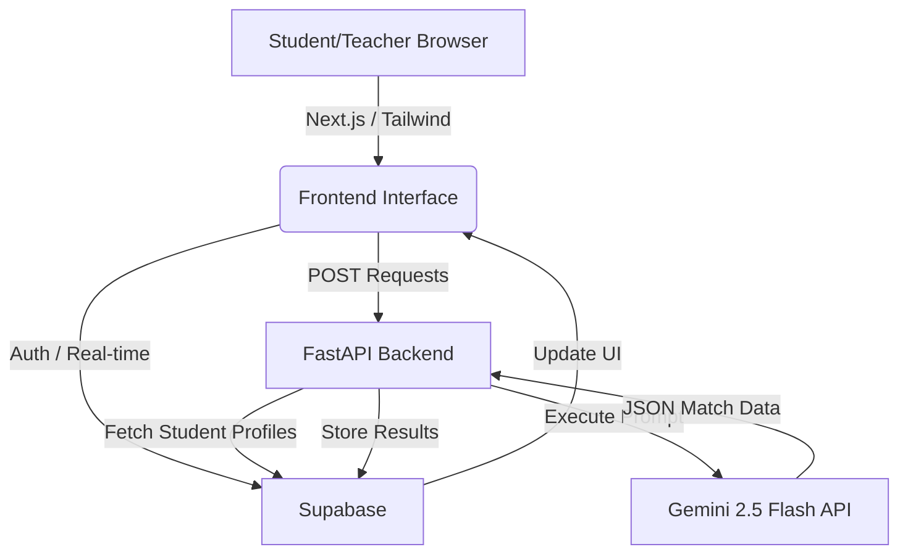

# Grand Challenge 2: Cohort Connect
This project is designed to address Grand Challenge 2

Problem Statement:
Current group formation methods priorities convenience over compatibility, leading to inefficient and often unenjoyable experiences. Incompatible matches can lead to isolation, poorer academic performance, and an overall negative perception of group work as a burden rather than an opportunity. 

We all have met this problem before personally, either through skill imbalances between teams, or mismatched work ethics between peer. This has lead in the past to negative experiences, which we believe should never be the case, and cause us to strive to make a difference.

Our solution is an intelligent peer-matching and collaboration platform for Imperial STEM. Features: AI matching (Gemini-Flash-2.5), collaboration features and accountability tracking. Built with Next.js, FastAPI, and Supabase for the Grand Challenge 2 2026.

Backend Language Python,Frontend language Java Script, API framework FastAPI, Database Supabase, AI matching Gemini API, Hosting next.js, Version control GitHub Required by brief

This is a [Next.js](https://nextjs.org) project bootstrapped with [`create-next-app`](https://nextjs.org/docs/app/api-reference/cli/create-next-app).

### Team: Cohort Connect
**Grand Challenge:** AI Agents for Matching Learners with Learners

## 🌍 Grand Challenge Addressed
In university settings, which range from high-stakes labs to complex mathematics coursework, group formation is often the weakest link. **Random Allocation** leads to clashes in working styles, while **Self-Selection** leads to students teaming up within their friend groups, often with similar skillsets.

**Cohort Connect** solves this by using an AI-based approach to group formation that ensures students share a common "work vibe" while possessing the diverse skills necessary to complete multifaceted projects.

## 💡 Problem Statement & Solution Overview
**The Problem:** Inefficient group work stems from two main issues:
1. **Approach Incompatibility:** Teammates who communicate or handle deadlines in fundamentally different ways.
2. **Skill Homogeneity:** Groups that lack specific technical or soft skills (e.g., a team of great coders who cannot write reports).

**The Solution: Cohort Connect** leverages **Gemini-2.5-Flash** to perform "Reasoning-based Grouping." By processing raw student survey data as a holistic thinking model, our agent applies:

1. **Alignment Logic:** Seeking high similarity in work ethics and communication styles (minimizing friction).
2. **Complementary Logic:** Seeking high diversity in technical competencies (maximizing project capability).
3. **Automated Synthesis:** The AI generates team names, project themes, and brief "Why you were matched" justifications for each group.


## 🛠 Technology Stack & Architecture

| Component | Technology | Role |
| :--- | :--- | :--- |
| **Frontend** | Next.js (JavaScript/React) | Responsive onboarding survey & student/teacher dashboards. |
| **Backend** | FastAPI (Python) | High-speed API managing AI prompts and database queries. |
| **AI Brain** | Gemini API (1.5-Flash) | LLM-based grouping logic and team synthesis. |
| **Database** | Supabase (PostgreSQL) | Relational storage for profiles, teams, and feedback. |
| **Security** | Row Level Security (RLS) | Ensures data privacy between students and teachers. |
| **Version Control** | GitHub | Collaborative development and CI/CD. |

### 🏗 Architecture Diagram

## 📊 The Matching Matrix
Our algorithm evaluates students based on three distinct categories:

### 1. Previous Subject Experience
* **A-Level (or equivalent) Background:** List of subject choices to identify baseline knowledge.
* **Ancillary Modules:** Ancillary module choices to ensure academic diversity within groups.

### 2. Relevant Skills (Complementary Matching)
Students are paired to ensure the group has high confidence (**4-5**) across all domains:
* **Coding** (1-5 confidence)
* **Written Reports** (1-5 confidence)
* **Presentation/Public Speaking** (1-5 confidence)
* **Mathematical Literacy** (1-5 confidence)
* **Understanding Abstract/Complex Content** (1-5 confidence)
* **Conflict Resolution** (1-5 confidence)

### 3. Approach to Work (Alignment Matching)
Students are paired based on similar scores to reduce friction:
* **Deadline Style:** Steady workers (**1**) vs. Under-pressure performers (**5**).
* **Discussion Style:** Listeners (**1**) vs. Leaders (**5**). *Note: This should be matched for alignment, not extreme bias.*
* **Disagreement Resolution:** Address issues directly (**1**) vs. Avoidance to prevent confrontation (**5**).
* **Concept Processing:** Independent work (**1**) vs. Collaborative work (**5**).
* **Communication Preference:** Frequent/Informal (**1**) vs. Structured/Formal (**5**).
* **Expectation Management:** Do it myself (**1**) vs. Discuss with teammate (**5**).
* **Workload Management:** Independent management (**1**) vs. Team redistribution (**5**).
* **Project Role:** Focused individual tasks (**1**) vs. Group coordination (**5**).
* **Critical Feedback Instinct:** Defensive/Explaining (**1**) vs. Listening/Revising (**5**).

---

## 🚀 Installation and Setup
### Prerequisites
* **Node.js:** [Insert Version]
* **Python:** [Insert Version]
* **Supabase Account**

### 1. Database Setup
1. Create a new Supabase project.
2. Go to the SQL Editor and run the provided supabase/schema.sql file to create the profiles, teams, and feedback tables
3. In Authentication > Providers, enable "Email" and toggle "Confirm Email" to OFF for easier testing.
4. Note your Project URL, Anon Public Key, and Service Role Key for the environment variables.

### 2. Backend Setup
```bash
cd backend
pip install -r requirements.txt
# Add SUPABASE_URL and SERVICE_ROLE_KEY to .env
uvicorn main:app --reload
```
### 3. Frontend Setup
```bash
cd frontend
npm install
# Add NEXT_PUBLIC_SUPABASE_URL and ANON_KEY to .env.local
npm run dev
```
## 📖 Usage Guide
**For Students**
1. Sign Up: Create an account using your university email.

2. Complete Survey: Fill out the skill and work-style assessment. This data is synced to the database for the matching agent.

3. View Team: Once the teacher triggers the match, your "Team Hub" will automatically update with your teammates' names and shared goals.

**For Teachers**
1. Monitor Cohort: View the list of students who have completed the survey under the "Teacher Dashboard."

2. AI Matching: Navigate to the "Sort Groups" tab. Click "Generate AI Teams" to trigger the Gemini-1.5-Flash orchestration.

3. Review & Analytics: View the formed teams and monitor student satisfaction scores through the real-time feedback analytics.


**🎥 Demo Video**
[Link to Demo Video Here]

## 👥 Team Member Details and Contributions
* **Chenbo Zhnag (Data Lead):** Designed the relational schema, SQL triggers for automated student/teacher routing, RLS security policies, and the data-locking mechanism.

* **Rob Jones (Frontend Lead):** Developed the Next.js UI, multi-page survey logic, and Supabase Auth integration.

* **Adam Fox (Backend/Algorithm Lead):** Developed the FastAPI engine and the AI Algorithm for the student match and team creation

* **Zuri Jarvis (Creative Lead):** Generated ideas for survey, presentation slides, monitoring the integration of frontend, backend and data.

## 📜 License Information
This project is licensed under the MIT License.

This project uses [`next/font`](https://nextjs.org/docs/app/building-your-application/optimizing/fonts) to automatically optimize and load [Geist](https://vercel.com/font), a new font family for Vercel.
